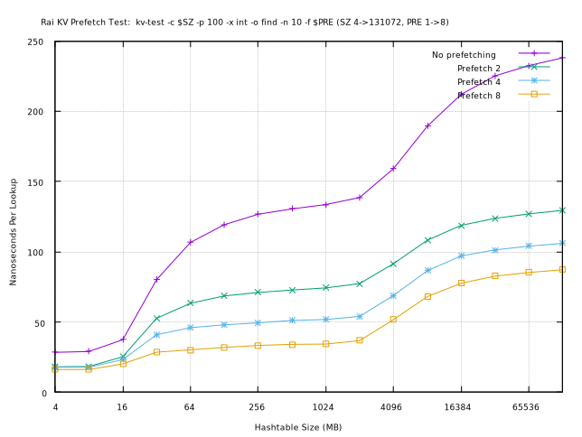
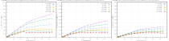
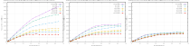
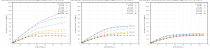
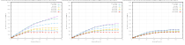
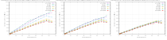

# Rai Key Value

[](https://copr.fedorainfracloud.org/coprs/injinj/gold/package/raikv/)

1. [Description of Rai KV](#description-of-rai-kv)
2. [Features of Rai KV](#features-of-rai-kv)
3. [How to Build Rai KV](#how-to-build-rai-kv)
4. [Installing Rai KV from COPR](#installing-rai-kv-from-copr)
5. [Testing Performance of Rai KV](#testing-performance-of-rai-kv)

## Description of Rai KV

Rai KV is a library for shared memory key value hashing, with per-thread and
per-process concurrency.  Writes are exclusive, reads are non-blocking.  The
in-memory KV store does not disappear from RAM when a program exits or the
software is updated and/or restarted.  Monitoring can be done out-of-band by
observing the stats within shared memory.  Both the keys and the values are
stored in shared memory in different structures.  The hash table is an array of
hash entries.  The value arenas are strips of memory that have affinities for
different processes or threads.

This KV library is evolved from the in-memory caching that [Rai
Technology](https://www.raitechnology.com) has been using in it's commercial
products for a long time.  It is simplified, so that only the basic operations
are of set, get, tombstone, and the concurrency of these ops are included.
What is not included are networking event loops, background garbage collection,
or resizing the tables and message arenas.  These things are depend on the
service configurations of higher level abstractions (batteries not included).

This library is used by the [Rai DS](https://github.com/raitechnology/raids)
application, which uses the Redis, Memcached caching protocols, as well as
bridging some other PubSub based caching protocols.

## Features of Rai KV

1. Exclusive Write, Read Many -- Lock granularity is on each hash entry, no
   global table locks.  Reads do not block and can occur concurrently, while
   writes have exclusive access.

2. [Cuckoo Hashing](https://en.wikipedia.org/wiki/Cuckoo_hashing) -- Cuckoo
   hashing is harder to attack with hashing denial of service, since multiple
   keys are used to distribute the hash locations in the hash table.  Tombstone
   performance is better, because there is a maximum of Arity * Buckets entries
   that are necessary to examine.

3. [MCS Locking](https://lwn.net/Articles/590243/) -- Each thread busy waits on
   it's own cache line when keys are hot.  It also enables fair queueing,
   across multiple processes.  The implementation also allows recovery of hash
   entry locks from processes which died while holding locks.

4. 128 Bit Hashing -- Based on [Meow
   Hash](https://github.com/injinj/meow_hash), more bits extracted, it uses 2
   rounds of AES, and is tested with
   [smhasher](https://github.com/injinj/smhasher).

5. Shared Memory -- The key value store does not disappear when a program
   exits, it persists so that load can be balanced by adding and subtracting
   processes.

6. Hash Prefetching -- Hash addressing can be calculated and prefetching can be
   used to hide the latency of memory.  This trades key lookup latency for key
   throughput as multiple key hashes must be computed and prefetched to gain
   throughput while single key latency is increased.

7. Built for caching messages and structures for Redis and Memcached, each
   entry has meta data that contains a key, optional TTL and update timestamps,
   the database key belongs to, and the type of value.  Them minimum size of
   each hash entry is 64 bytes and can contain the key and the value if the
   size is less than 32 bytes: { 16b hash, 2b val, 1b db, 1b type, 2b flags, 2b
   keylen, 32b key + value, 2b size, 6b serial }.

8. Concurrent access to a value storage.  Each client is able to reclaim space
   from dropped entries without a GC intermediary process.  The hash entries
   contain smart pointers into value storage.  A smart pointer is a 128 bit
   value containing a serial number based on the hash (serial = hash + update
   counter), location, and size.  It allows concurrent read access while writes
   are mutating the values.

## How to Build Rai KV

The current implementation uses x86_64 hardware based AES hashing and can use
Posix, SysV, or mmap() based shared memory.  These Linuxes are known to work:
CentOS 7, 8 or Fedora >=27, or Ubuntu 16, 18, 20, or Debian 9, 10.  It will
also run under Windows Subsystem for Linux with Ubuntu 18.  Minimum x64 CPU is
a Intel Sandy Bridge or an AMD Ryzen (with AVX/SSE4 extentions).

### Software dependencies

Building needs make and gcc-c++.  RPM or Debian package creation needs chrpath,
rpm-build or devscripts.  LSB (Linux Standard Base) is also recommended, but
not necessary, it's used to determine the distro installed.

CentOS/Fedora

```console
$ sudo dnf install make gcc-c++ chrpath rpm-build redhat-lsb
```

Ubuntu/Debian

```console
$ sudo apt-get install make gcc-c++ chrpath devscripts lsb-core
```

### Building

Make will build the binaries, `make dist_rpm` builds the RPM packaging,
and `make dist_dpkg` builds the Debian packaging.

```console
$ make
$ make dist_rpm
$ sudo dnf install rpmbuild/RPMS/x86_64/raikv*.rpm
```

### Testing

After `make` runs, there will be binaries built in a directory based on the
type of distro installed, for example, if Centos 7 or RHEL 7 is used, then the
build tree is under `RH7_x86_64`.  Run `kv_server` in one terminal, and
`kv_test` and/or `kv_cli` in another terminal.

Running `kv_server`

```console
$ RH7_x86_64/bin/kv_server
```

Running `kv_cli`

```console
$ RH7_x86_64/bin/kv_cli
> set hello world
[732328] [h=0x2aa73a1eeb0b2d45:fd102121185ce157:chn=0:cnt=36:db=0:val=0:inc=0:sz=5] (-Upd-Ival-Key,MD_STRING) put
> get hello
4292 [hash] 15281 [find] 4107 [value]
[732328] [h=0x2aa73a1eeb0b2d45:fd102121185ce157:chn=0:cnt=36:db=0:val=0:inc=0:sz=5] (-Upd-Ival-Key,MD_STRING) get
->"world"
```

The `kv_cli` program is meant for debugging the state of the KV, it displays
the internals of each entry:

- [732328] -- which hash entry location is used
- h -- the 128 bit hash
- chn -- the number of collisions before the entry was found
- cnt -- the number of times the entry was updated (a 48 bit number)
- db -- the database number the entry belongs to (a 8 bit number)
- val -- a 16 bit value (for memcached)
- inc -- which cuckoo hash is used
- sz -- the immediate data size
- flags -- what flags are set (`Upd` : updated, `Ival` : immediate value, `Key`
  : immediate key, `MD_STRING` : type of data)

## Installing Rai KV from COPR

Current development RPM builds are installable from [copr](https://copr.fedorainfracloud.org).

```console
$ sudo dnf copr enable injinj/gold
$ sudo dnf install raikv
```

If it is necessary to uninstall and removing the copr repository:

```console
$ sudo dnf remove raikv
$ sudo dnf copr disable injinj/gold
```

### Running Rai KV after Installing

The kernel command line can be changed to set the default hugepagesize to 1G
pages.  This isn't necessary, but it may improve performance.  The memlock
limits should be adjusted according to the KV size.  If the KV memory can't be
locked, the mapping of virtual memory to physical memory by the kernel can add
significant latency when dereferenced for the first time, which may be fine if
initial latency irrelevent.

```console
$ sudo vi /etc/default/grub

# Modify to have hugepagesz=1G.
GRUB_CMDLINE_LINUX="resume=/dev/mapper/fedora-swap rd.lvm.lv=fedora/root rd.lvm.lv=fedora/swap rhgb quiet default_hugepagesz=1GB hugepagesz=1G hugepages=128"

$ sudo grub2-mkconfig -o /boot/efi/EFI/fedora/grub.cfg

$ sudo vi /etc/security/limits.conf

# Append so any user can mlock() 128GB.
*                hard    memlock         134217728
*                soft    memlock         134217728
```

The packaging includes a systemd service that runs `kv_server` with a small 2GB
shared memory segment using the sysv facility with a user and group of "raikv".
Programs should be in this group:

```console
# may need to logout, login after changing user
$ sudo usermod -a -G raikv username
```

The group raikv allows other processes to use the memory created by
`kv_server`.  If owner permissions are needed instread of group permissions, a
change should be made to run with the argument `-o ugo+rw` or with the
appropriate owner permissions.  These are set in the
`/lib/systemd/system/raikv.service` file.

```console
$ sudo systemctl start raikv
$ journalctl -u raikv.service
$ sudo ipcs -m
------ Shared Memory Segments --------
key        shmid      owner      perms      bytes      nattch     status
0x9a6d37aa 360466     raikv      660        68719476736 1
```

The key above in the "Shared Memory Segment" is a hash of the name of the KV
map.  Multiple maps may exist, they are attached by name, in this case the
name is "sysv:raikv.shm" and the key in the first column is a hash of that.

The shared memory can map using 1G or 2M page sizes.  The alternative is to
mount a ram file system with hugepages and use the mmap facility, or the posix
facility in the case of /dev/shm.  Sometimes the Linux kernel ignores the page
size advisory of the system call for shared memory mapping.  The memory page
size can be examined by looking at `/proc/pid/smaps`.  In this case, the memory
was acquired by the System V facility:

```console
$ cat /proc/`pidof kv_server`/smaps | grep -A 3 SYSV
7ff680000000-7ff700000000 rw-s 00000000 00:0f 2424889                    /SYSV9a6d37aa (deleted)
Size:            2097152 kB
KernelPageSize:  1048576 kB
MMUPageSize:     1048576 kB
```

Or, just run `kv_server` directly.  The `kv_server` program isn't necessary
after shm segment is created.  It logs statistics, updates the time for
programs that use TTL, and recovers the hash table entry locks if a program
dies, which can be important if other programs are running and waiting for the
same lock, but, it does nothing to verify consistency of the value stored.

## Testing Performance of Rai KV

These are results of using the `kv_test` program.  The intention of this is to
show with a very simple test program, what the KV lookup and store overhead is.
If these are run, stop the raikv.service if it is running.  These gnuplot
scripts create the shm segments and destroy the old ones as they resize.

These are using gcc 10.1.1, Fedora 32 (5.7.7-200.fc32), Ryzen 3970x and with
256GB of 3200mhz ram, hyper-threading enabled, 1G hugepagesize, with 3.7ghz to
4.5ghz turbo enabled.  A cursory test of the performance delta between ram
speeds, there is about 10% gain doing a single thread write exclusive hash
table entry acquire spanning 512MB: (2166mhz) 103ns -> (2400mhz) 94ns ->
(3200mhz) 82ns.

### Prefetching hashtable lookups

The effect of prefetching on hash table lookup can be dramatic using
[`__builtin_prefetch()`](https://gcc.gnu.org/onlinedocs/gcc/Other-Builtins.html),
particularily with AMD Ryzen, which can double the throughput.  The prefetching
algorithm in `kv_test` is

Prefetching = 2

  hash A, prefetch A, hash B, prefetch B, lookup A, lookup B

Prefetching = 4

  hash A, prefetch A, hash B, prefetch B, hash C, prefetch C
  hash D, prefetch D, lookup A, lookup B, lookup C, lookup D

Ordering the lookup in this way, the memory latency is hopefully hidden by the
hashing, since memory latency (100ns) is similar to calculating 5 hashes (5 *
20ns).  It is important to note that this trades key lookup latency for key
throughput.  The time for A to resolve is adds the latency of hash B, C, D.
The time for D to resolve adds the latency of lookup A, B, C.

In the following prefetch test, the hash table changes size but there are no
elements inserted, so there are no collisions and all lookups result in not
found.  The keys are hashed and the memory is dereferenced, but the key has no
value stored.  The number of hashes looked up is the hash table size / 64 bytes
minus some overhead, so a 64GB hash table resolves 1,073,734,656 hash entries.



### Multithreaded scalability

In the following multithreaded tests, the number of threads and the size of the
KV is scaled using different hashtable loads.  Each thread uses a random key
distribution, so they should be perfectly scalable as long memory bandwidth and
the cache coherence is also scalable.  These all use immediate values without
message arenas, writing an 8 byte int to the key value.  The MCS locks used in
this library scale well when the threads contending for exclusive write access
are not sleeping, but can suffer if the OS decides that something else needs to
run.  Faleiro and Abadi explore MCS scalability here: "[Latch-free
Synchronization in Database Systems: Silver Bullet or Fool's
Gold?](http://www.jmfaleiro.com/pubs/latch-free-cidr2017.pdf)."  These are not
isolated from the system or pinned to cores, there may be a little noise.

1. Scaling write-only threads, random inserts at different hash table loads,
   preloaded.

[](graph/mt_write.md)

2. Scaling read-only threads, random finds at different hash table loads,
   preloaded.

[](graph/mt_read.md)

3. Scaling 90% read, 10% write threads, random at different hash table loads,
   preloaded.

[](graph/mt_ratio90.md)

4. Scaling 50% read, 50% write threads, random at different hash table loads,
   preloaded.

[](graph/mt_ratio50.md)

5. Scaling 90% read, 10% write threads, [YCSB zipf](graph/ycsb_zipf.md) random
   at different hash table loads, preloaded.

[](graph/mt_ratio90_zipf.md)

6. Scaling 50% read, 50% write threads, [YCSB zipf](graph/ycsb_zipf.md) random
   at different hash table loads, preloaded.

[](graph/mt_ratio50_zipf.md)

The relative performance of different hash table loads for a random key
distribution is largely driven by the effectiveness of the L3 cache and the
number of chains necessary to traverse to load the hash entry.  The chain
lengths for load 25% is 1.17, load 50% is 1.46, and load 75% is 2.00.

The [YCSB zipf](graph/ycsb_zipf.md) tests, even though there is a lot more
cache coherence traffic than the random tests, produces better results than
random because both the L3 cache is more effective and the number of chains to
traverse is less because the higher key probabilities are also inserted into
the hash table first, at the head of the chain.  If the access patterns are
skewed like the zipf distribution, then optimizing the chain lengths would
probably be an effective use of resources.

All of the above can be recreated by running the shell scripts in the graph
directory and using gnuplot to plot them.  The shell scripts do contain testing
with memory usage up to 128GB, so that may need to be modified if the test
machine does not have enough memory.

```console
$ sh /usr/share/doc/raikv/graph/run_mt_scale_write_25.sh
$ gnuplot-qt -p -c /usr/share/doc/raikv/graph/plot_mt_scale_write_25.gnuplot
```
