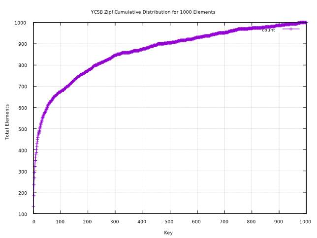

# YCSB Zipf Random

The function that generates keys that `kv_test` uses for the
[zipf](https://en.wikipedia.org/wiki/Zipf%27s_law) distribution, is derived
from a well known benchmark called the [Yahoo! Cloud Serving
Benchmark](https://github.com/brianfrankcooper/YCSB), in the Java Class named
[ZipfianGenerator.java](https://github.com/brianfrankcooper/YCSB/blob/master/core/src/main/java/site/ycsb/generator/ZipfianGenerator.java).
This generator and the one in `kv_test` use a skew of 0.99.

The method used by `kv_test` is by calculating the load of the hash table and
using that to bound the limits of the key generator.  If the hash table size
was 2000, then the above graph could represent the keys at hash table load 50%.
The key range is 0 -> 1000, and the distribution follows the generator's power
law function, where 0 is the most popular key.

Here are the counts of the keys 0->10 for 1000 elements.

| Key | Count |
|-----|-------|
|  0  |  134  |
|  1  |   51  |
|  2  |   50  |
|  3  |   33  |
|  4  |   27  |
|  5  |   27  |
|  6  |   17  |
|  7  |   11  |
|  8  |   17  |
|  9  |   13  |
| 10  |    7  |
